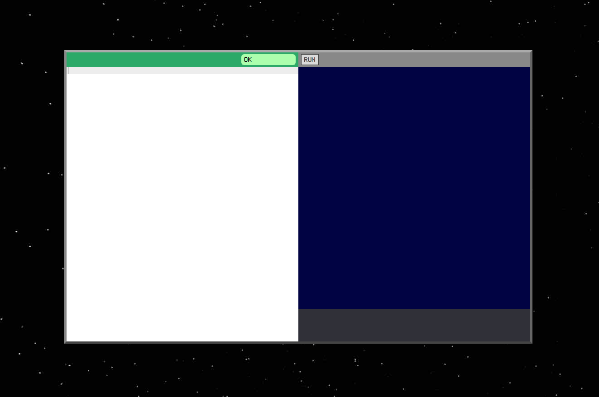
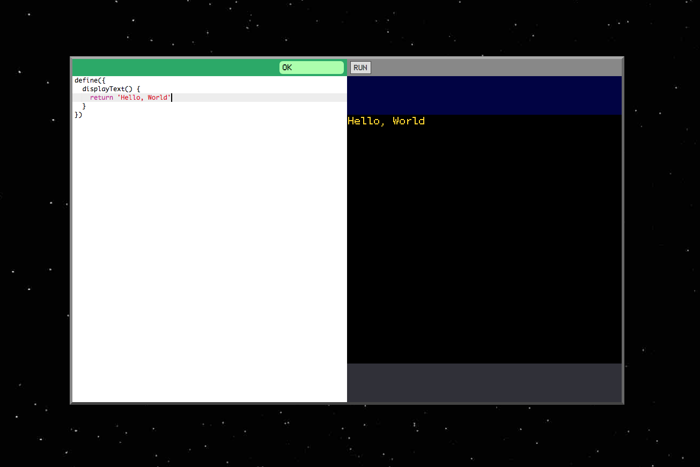

Awesome! I'm so glad you've chosen Verse for learning to
program. Coding is (or can be, at least) one of the most
fun hobbies/careers out there, so I hope I can impart some
of that joy in these tutorials.

If you get stuck or have any questions as you work through
the examples and exercises, please post
[@VerseCode on Facebook](https://www.facebook.com/VerseCode/)
and I'll do my best to help you out.

# Supported Platforms

Before we get started, let's make sure you have the right
setup. Currently, Verse works on macOS 10.11 (El Capitan)
or newer (it *might* work on Windows and Linux, but I
haven't tested it).

Additionally, you'll need the latest version of one of
these web browsers:

- [Firefox](https://www.mozilla.org/en-US/firefox/new/) (recommended)
- [Chrome](https://www.google.com/chrome/index.html)

Support for more platforms (including mobile) is coming
soon, but for now it's just these. If there's a particular
OS or browser you think I should support, just post on
the [Verse Facebook page](https://www.facebook.com/VerseCode/).
If enough people ask for it, I'll figure out a way to
make it work.

# Hello, World!

Okay, you've installed an awesome web browser and you're
ready to code! [Right-click this link and open it in a new
window to bring up Verse](https://druidic.github.io).



The white area—the left half of the screen, basically—is
the *editor*, the place where we'll type
our code. When the code runs, it will display things on
the right half of the screen.

We'll start with the classic introduction to coding:
the "Hello, World" program, which just makes the text
"Hello, World" (or whatever message we want) appear on the
screen.

To start, type the code below into the editor. To type the
`{}` characters, hold `shift` and use the keys just to the
right of `P` (assuming you have an American keyboard).

```javascript
define({
})
```

This line of code forms the backbone of our program. All
our other code will go between the curly braces `{ ... }`.

Once you've typed that out, the word "OK" should be shown
in a green bubble at the top right of the editor. This
indicates that the computer understands what you typed. If
it says "Can't run" instead, check your work and make sure
it matches the example. Computers are very picky about the
code they'll accept.

Now let's define a **function** that will put our "Hello,
World" message on the screen. A *function* is a list of
instructions for the computer that tell it how to perform
some task and give us back the result. If you think of the
computer as a restaurant cook, a function is like a recipe
that tells it how to make one of the items on the menu.

To define a function, we first have to give it a name.
Most of the time when we create a function, we can choose
any name we want as long as it contains only letters and
numbers (no spaces or punctuation). However, we're going
to give this function a very specific name: `displayText`.
The name `displayText` tells Verse to use this function to
determine what text will be shown on the screen when the
program runs.

After the name of the function, we need to put a pair
of parentheses `()` and a pair of curly braces `{}`.

```javascript
define({
  displayText() {
  }
})
```

When your code looks like the example above, you should
see the green "OK" bubble again. If it says "Can't run"
instead, check your work for mistakes.

> If nothing you type seems to give you the "OK" at this
> point, just copy-paste the example code into the editor.
>
> If you've copy-pasted it and it *still* doesn't work,
> please message
> [@VerseCode on Facebook](https://www.facebook.com/VerseCode/)
> and let me know.

We're almost done! We have a function, but it doesn't do
anything. We just need to add an instruction,
or *statement*, between the curly braces. The computer will
follow this instruction when it runs the `displayText`
function.

```javascript
define({
  displayText() {
    return 'Hello, World!'
  }
})
```

Here, we're using the `return` keyword to hand off the text
`'Hello, World!'` to the computer. The text will then get
drawn on the screen. We surround the text in single quotes
so the computer knows where it begins and ends.

When you're done typing, you should once again see the
green "OK" bubble. If you do, you can click the "Run"
button just to the right of it to run your program!

## Experiments

Now that you've got a working chunk of code, I encourage you
to play around with changing it to see what works and
what doesn't.

1. Try changing the function name `displayText` to something
   else. What happens?
2. The quotes around 'Hello, World!' tell the
   computer exactly where the text starts and ends. Try
   changing 'Hello, World!' to 'Doesn't work'. What do
   you think is causing the problem?
3. Change the text 'Hello, World!' to whatever message you
   want.
4. Try deleting the spaces and indentation from the code.
   Which spaces are necessary and which ones aren't?
5. Try adding more spaces between the words and punctuation.
   Are there places where adding spaces will break the code?
6. What happens if you delete the `return` keyword?



Congratulations! You've written your first program and taken
your first steps into the world of Verse! Let's review the
key things we've learned:

- In Verse, we write code on the left half of the screen,
  and see our programs run on the right half.
- Every program is wrapped in `define({ ... })`.
- Programs are built by defining *functions*, which are like
  recipes the computer follows to make whatever we want.
- When we want to define a snippet of text that the computer
  should process, we surround it in single quotes so the
  computer knows exactly where it starts and ends.
- When a function with the name `displayText`
  `return`s a piece of text, that text is shown on the
  screen when the program runs.

# Shouting at the World

Our program is currently rather uninteresting. Let's see if
we can make it automatically transform our "Hello, World"
greeting into ALL CAPS SO IT LOOKS LIKE IT'S SHOUTING.

```javascript
define({
  displayText() {
    return uppercase('Hello, World!')
  }
})
```

Here we see our first example of how to *call*, or use, a
function in JavaScript. We're calling a function named
`uppercase` by mentioning its name
and following it with a
pair of parentheses. Between the parentheses, we feed in
some data: the text 'Hello, World!'. The function
processes the text and gives us back the result, which we
`return` so it is displayed on the screen.

Returning to our functions-are-recipes metaphor:
calling a function is like shouting to the cook "one order
of fried applesauce for table 6, please!". Except instead,
we're asking for "one order of uppercase hello world!"

Just to illustrate this, here's how we'd ask the
computer for fried applesauce:

```javascript
define({
  displayText() {
    return fried('applesauce')
  }
})
```

And this would totally work if our computer knew how to
fry text. But there's no function named `fried`, so this
program will give us an error if we try to run it.

You may be wondering where the `uppercase` function comes
from. In other words, why does `uppercase` work but `fried`
doesn't? The answer is pretty boring: the `uppercase`
function is just built into Verse. A list of built-in
functions and how to use them ~~is available here~~ will be
available once I get my act together.

## The Beauty of Functions

If you just look at the output of our little program, it's
exactly the same as if we'd written

```javascript
define({
  'try me'() {
    return 'HELLO, WORLD!'
  }
})
```

That's because a *function call* like `uppercase('Hello, World!')`
stands in for the result of the function. You can replace
one with the other and the output of the program won't
change. The five-dollar term for this is *referential
transparency* (and yes, you can totally impress people by
mentioning referential transparency at parties).

Of course, you may be wondering: why *not* just replace the
function call with the uppercased result? It would be a lot
simpler! But then we would be doing work that the computer
can do much more quickly and accurately. The nice thing
about calling `uppercase` is that we can now convert any
text we want to all-caps, just by copy-pasting it into our
program. Try it with this paragraph! Just make sure you have
quotes around the text so the computer knows where it begins
and ends.

At this point, you may be starting to sense that functions
have a beautiful kind of usefulness. Once you know the name
of a function and what it does, it's like having a new skill
that you can use everywhere. A good cook knows not only how
to make `fried('applesauce')`, but `fried('lamb chops')` or
`fried('crème brûlée')` too. Just as *frying* is a process that can
be applied to almost anything, *uppercasing* is a process
that can be applied to any text. In programming, this type
of simple process that can be applied to an infinity of
different objects is called an *abstraction*.

# Talking Backwards

Let's try out another function that's built into Verse:
`reverse`, which takes a string of text and returns a
backwards version of it, so `hello` becomes `olleh`.

```javascript
define({
  displayText() {
    return reverse('Hello, World!')
  }
})
```

## Experiments

1. Try replacing "Hello, World!" in the program above
   with a message of your choice.
2. A word or phrase that is spelled the same forwards and
   backwards is called a *palindrome*. Use the `reverse`
   function to demonstrate that `tacocat` is a palindrome. Or
   try this epitaph for Napoleon: `able was I ere I saw elba`.
3. Try writing a program that outputs the reversed,
   uppercase version of a string: that is, if you paste in
   the text 'hello world' it should output 'DLROW OLLEH'.
   Hint: remember that a function call stands in for the
   result of the function.
4. It seems like `reverse(uppercase('hello'))`
   and `uppercase(reverse('hello'))` always produce the
   same output. Why do you think this is?
5. What do you expect `reverse(reverse('hello'))` to output?
   Try it!

# Making an Interactive Program

The programs we've written so far have an unfortunate
shortcoming: in order to make them process different text,
we have to change their code. That makes them
next to useless for people who don't know how to program.

We need to make our programs *interactive* so anyone can use
them. For example, it would be great if our "reverse"
program could prompt the user to type in the text they want
to reverse, and then show them the reversed output.

In Verse, we create interactive programs by defining a
special function called `run`. We'll learn more about how
this function works in later tutorials; for now just
copy the code below.

```
define({
  process(input) {
    return reverse(input)
  },

  *run() {
    let input = yield waitForInput()
    yield log(process(input))
    yield retry()
  }
})
```

<!--
# Hello, You!

What's next for our "Hello, World" program? How about a
program that greets a specific person, given their name?

```javascript
define({
  'try me'() {
    return greetingFor('Alex')
  },

  greet(name) {
    return 'Hello, ' + name + '!'
  }
})
```

# Tutorial: Variables

**Variables** are one of the most useful concepts in
programming. A variable is like a container where you can
store information (like text and numbers) that you aren't
going to use right away but want to save for later.

We can create a new variable using the `let` keyword. When
we create a variable we have to give it a name so we can
refer to it later.

For example, this code (which you'd normally put inside a
function), creates a variable named `awesomePerson`.

```javascript
let awesomePerson
```

Once we have a variable, we can store some information in it
using the `=` symbol:

```javascript
let awesomePerson
awesomePerson = 'Margaret Hamilton'
```

As a shorthand for the above, we can use `let` and `=` at
the same time:

```javascript
let awesomePerson = 'Margaret Hamilton'
```

Stuff we've stored in a variable is called the *value* of
that variable. We can get the value of a variable back out
just by using its name, like this:

```javascript
yield log(awesomePerson)
```

Putting it all together, we can write programs like this:

```javascript
define({
  *init() {
    let awesomePerson = 'Margaret Hamilton'
    let accomplishment =
      'Wrote guidance software for the Apollo moon landings'

    yield log(awesomePerson)
    yield log(accomplishment)
  }
})
```

-->
