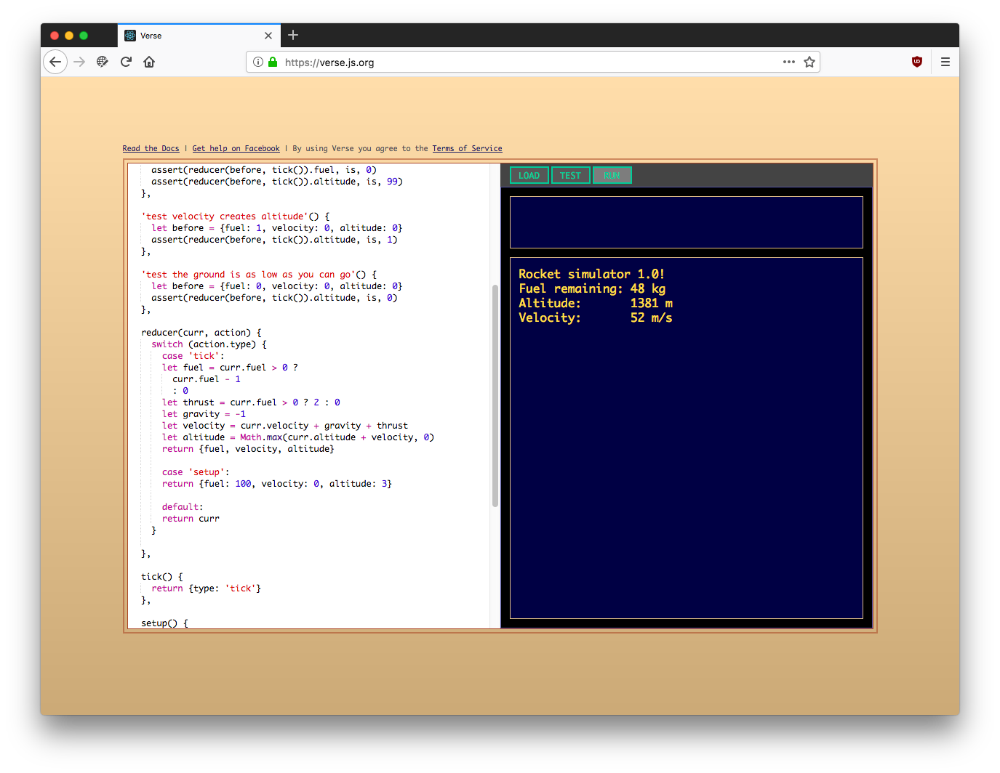

# Welcome!

**Verse is an online coding tool** that makes it easy to
create programs and games using JavaScript, the
programming language of the Web.

**Verse is designed with beginners in mind.** It's a great way
to [start learning to code](./beginner/). But even professional programmers
will find it useful for quickly sketching ideas or bringing
their side projects to life.



## Getting Started

[**Try it out!**](https://verse.js.org) No need to create
an account or log in. Just click the link and start coding.
Here's a simple program you can copy-paste to get started:

```javascript
define({
  *run() {
    let name = yield waitForInput("Hello! What's your name?")
    yield log('Nice to meet you, ' + name + '!')
    yield wait(1)
    yield retry(run)
  }
})
```

## Tutorials

There are several tutorials available for Verse, linked
below. Pick the one that best suits your level of
programming experience.

- [I'm new to programming!](./beginner/) *(beginner tutorial)*
- [I know how to program but I don't know JavaScript.](./intermediate/) *(intermediate tutorial)*
- [I already know JavaScript.](./advanced/) *(advanced tutorial)*

## Other Resources

- [Frequently-answered questions](./faq)

## Legal Stuff

By using Verse, you agree to our [Terms of Service](./tos).
We know you won't read them, so here's the TL;DR:

- Don't be evil.
- Don't sue us.

Have fun!
